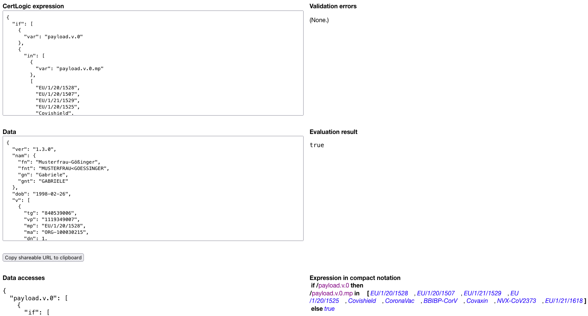

[CertLogic Fiddle](https://certlogic-fiddle.vercel.app/) is a small, “IDE-like” mini-app to “fiddle” around with CertLogic - somewhat like the well-known [JSFiddle tool](https://jsfiddle.net/).

* https://certlogic-fiddle.vercel.app/

You can use CertLogic Fiddle to quickly write, and (sort-of) debug CertLogic expressions.
You can share a CertLogic expression plus the data it operates on with others through a generatable URL.
That makes it easy to collaborate on implementing, understanding, and debugging business rules.

The following screenshot shows CertLogic Fiddle with the expression of a business rules for checking whether a vaccination DCC has an accepted vaccine:

