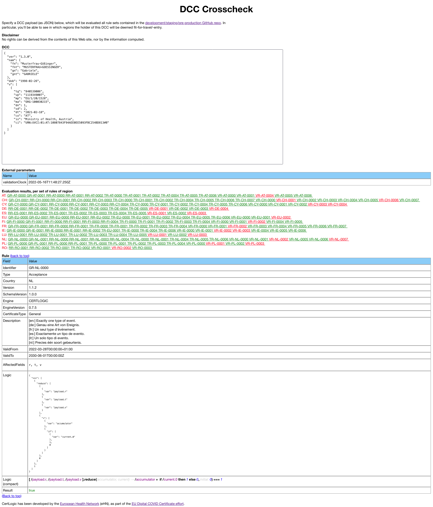

[DCC Crosscheck](https://dcc-crosscheck.vercel.app/) is a mini-app to run a DCC payload against the business rules contributed by various countries to the [development/staging/pre-production GitHub repo](https://github.com/eu-digital-green-certificates/dgc-business-rules-testdata).

* https://dcc-crosscheck.vercel.app/

The following screenshot shows this app in action:

This is for informational and development purposes only!
The rules in this mini-app are **not** the actual rules.
No rights can be derived from it.

