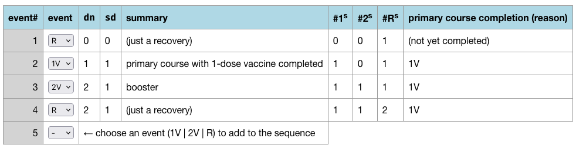

[DCC Encoding](https://dcc-encoding.vercel.app/) is a mini-app to demonstrate how to encode a vaccination + recovery history into the `dn`/`sd` fields of a DCC.

* https://dcc-encoding.vercel.app/

The following screenshot shows such a history with the encoding of all the resulting DCCs:

Note that this is for informational and development purposes only!
No rights can be derived from this app.

