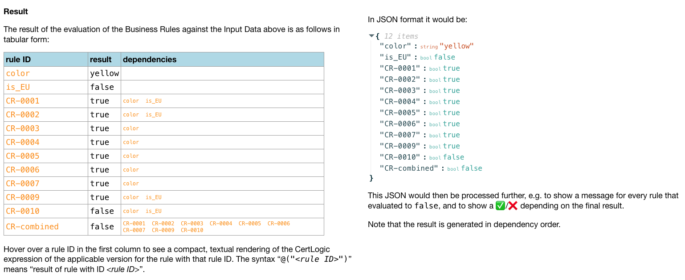

[NNon-DCC rules prototype](https://non-dcc-rules-prototype.vercel.app/) is a prototype/tech demonstrator that naturally extends the current DCC validation framework to be able to handle non-DCC data in a useful way.

* https://non-dcc-rules-prototype.vercel.app/

The following screenshot shows part of this prototype in action:

